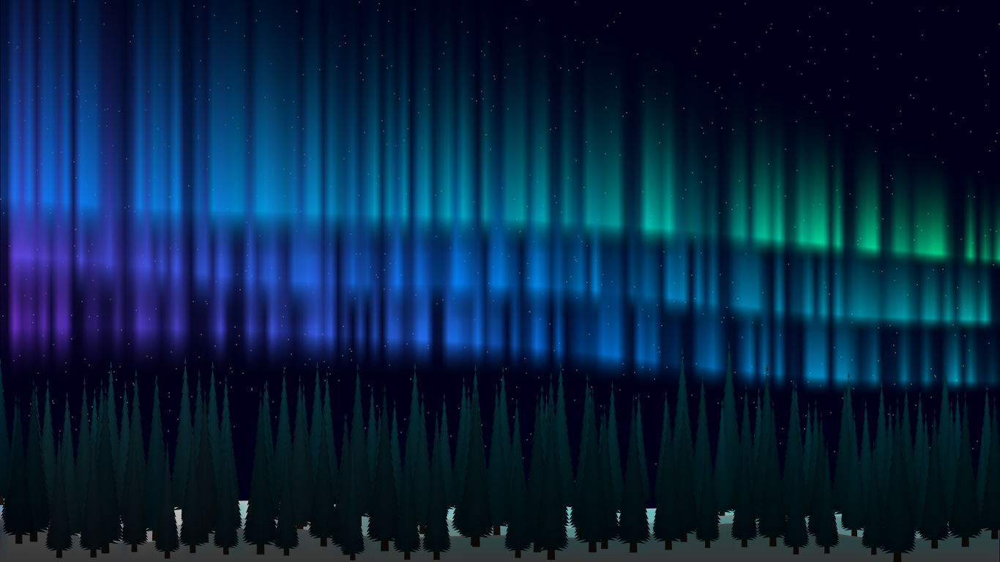

Fox Fires
=========

Simple program, that draws a famous polar lights.

Usage
-----

* <kbd>Escape</kbd> - Close window (exit)
* <kbd>Space</kbd> - Pause
* <kbd>T</kbd> - Pause time
* <kbd>F3</kbd> - Debug screen
* <kbd>F5</kbd> - Re-init layers
* <kbd>F5</kbd> + <kbd>Shift</kbd> - Re-init program
* <kbd>H</kbd> - Hide cursor
* <kbd>S</kbd> - Skip day
* <kbd>R</kbd> - Toggle realistic mode
* <kbd>F</kbd> (<kbd>F11</kbd>) - Fullscreen
* <kbd>←</kbd>, <kbd>→</kbd> - Change time (10 times faster when holding <kbd>Shift</kbd>)

Realistic mode
--------------

Difference between realistic and normal modes is only in colors. In this mode color update and processing completely disabled. This can give small FPS boost. Also this mode shows more natural northern lights because of colors, that was selected to match oxygen and nitrogen light emission.

