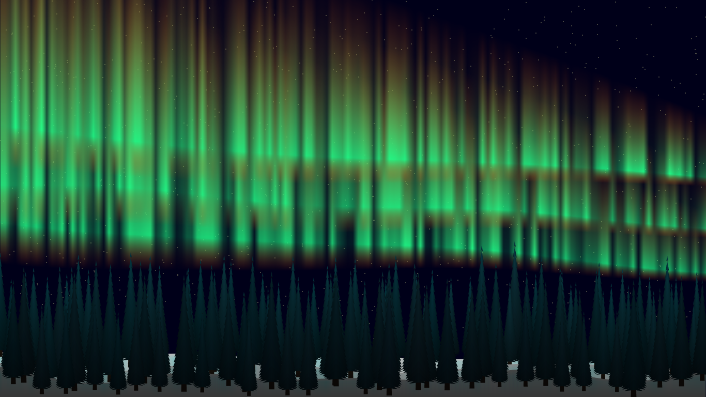

Fox Fires
=========

Simple program, that draws a famous polar lights.

Usage
-----

* <kbd>Escape</kbd> - Close window (exit)
* <kbd>Space</kbd> - Pause
* <kbd>T</kbd> - Pause time
* <kbd>F3</kbd> - Debug screen
* <kbd>F5</kbd> - Re-init layers
* <kbd>F5</kbd> + <kbd>Shift</kbd> - Re-init program
* <kbd>H</kbd> - Hide cursor
* <kbd>S</kbd> - Skip day
* <kbd>F</kbd> (<kbd>F11</kbd>) - Fullscreen
* <kbd>←</kbd>, <kbd>→</kbd> - Change time (10 times faster when holding <kbd>Shift</kbd>)

Realistic mode
--------------

After watching a lot of videos on youtube, old but remastered realistic mode has returned.

Use <kbd>R</kbd> to activate it.

